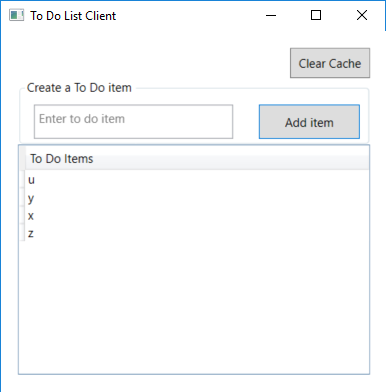

# Integrating Azure AD into a Windows desktop application using interactive authentication


## About this sample

### Scenario

This sample demonstrates a .Net WPF application calling a web API that is secured using Azure AD.

1. The .Net TodoListClient WPF application uses the Active Directory Authentication Library (ADAL) to obtain a JWT access token from Azure Active Directory (Azure AD) through the OAuth 2.0 protocol:
2. The access token is used as a bearer token to authenticate the user when calling the /todolist endpoint of the TodoListService web API.


Once you've started the TodolistService, you can run the TodoListClient WPF application, click on the *sign-in* button, and then enter items in a todo list. When you close the application and reopen it, the list is still displayed, as long as the service is running (it maintains the todo list in memory), or until you click on the *Clear Cache* button. At this point, you'll need to sign in again (and can use another identity). You will manipulate the todo list of the identity you signed-in with.



For more information about how the protocols work in this scenario and other scenarios, see [Authentication Scenarios for Azure AD](http://go.microsoft.com/fwlink/?LinkId=394414).

> Looking for previous versions of this code sample? Check out the tags on the [releases](../../releases) GitHub page.

## How to run this sample

To run this sample, you'll need:

- [Visual Studio 2017](https://aka.ms/vsdownload)
- An Internet connection
- An Azure Active Directory (Azure AD) tenant. For more information on how to get an Azure AD tenant, see [How to get an Azure AD tenant](https://azure.microsoft.com/en-us/documentation/articles/active-directory-howto-tenant/)
- A user account in your Azure AD tenant. This sample will not work with a Microsoft account (formerly Windows Live account). Therefore, if you signed in to the [Azure portal](https://portal.azure.com) with a Microsoft account and have never created a user account in your directory before, you need to do that now.

### Step 1:  Clone or download this repository

From your shell or command line:

`git clone https://github.com/Azure-Samples/active-directory-dotnet-native-client.git`

> Given that the name of the sample is pretty long, and so are the name of the referenced NuGet pacakges, you might want to clone it in a folder close to the root of your hard drive, to avoid file size limitations on Windows.

### Step 2:  Register the sample with your Azure Active Directory tenant

There are two projects in this sample. Each needs to be separately registered in your Azure AD tenant. To register these projects, you can:

- either follow the steps in the paragraphs below ([Step 2](#step-2--register-the-sample-with-your-azure-active-directory-tenant) and [Step 3](#step-3--configure-the-sample-to-use-your-azure-ad-tenant))
- or use PowerShell scripts that:
  - **automatically** create for you the Azure AD applications and related objects (passwords, permissions, dependencies)
  - modify the Visual Studio projects' configuration files.

If you want to use this automation, read the instructions in [App Creation Scripts](./AppCreationScripts/AppCreationScripts.md)

#### First step: choose the Azure AD tenant where you want to create your applications

As a first step you'll need to:

1. Sign in to the [Azure portal](https://portal.azure.com).
1. On the top bar, click on your account, and then on **Switch Directory**.
1. Once the *Directory + subscription* pane opens, choose the Active Directory tenant where you wish to register your application, from the *Favorites* or *All Directories* list.
1. Click on **All services** in the left-hand nav, and choose **Azure Active Directory**.

> In the next steps, you might need the tenant name (or directory name) or the tenant ID (or directory ID). These are presented in the **Properties**
of the Azure Active Directory window respectively as *Name* and *Directory ID*

#### Register the service app (TodoListService-NativeDotNet)

1. In the  **Azure Active Directory** pane, click on **App registrations** and choose **New application registration**.
1. Enter a friendly name for the application, for example 'TodoListService-NativeDotNet' and select 'Web app / API' as the *Application Type*.
1. For the *Sign-on URL*, enter the base URL for the sample. By default, this sample uses `https://localhost:44321/`.
1. Click **Create** to create the application.
1. In the succeeding page, Find the *Application ID* value and record it for later. You'll need it to configure the Visual Studio configuration file for this project.
1. Then click on **Settings**, and choose **Properties**.
1. For the App ID URI, replace the guid in the generated URI 'https://\<your_tenant_name\>/\<guid\>', with the name of your service, for example, 'https://\<your_tenant_name\>/TodoListService-NativeDotNet' (replacing `<your_tenant_name>` with the name of your Azure AD tenant)

#### Register the client app (TodoListClient-NativeDotNet)

1. In the  **Azure Active Directory** pane, click on **App registrations** and choose **New application registration**.
1. Enter a friendly name for the application, for example 'TodoListClient-NativeDotNet' and select 'Native' as the *Application Type*.
1. For the *Redirect URI*, enter `https://<your_tenant_name>/TodoListClient-NativeDotNet`, replacing `<your_tenant_name>` with the name of your Azure AD tenant.
1. Click **Create** to create the application.
1. In the succeeding page, Find the *Application ID* value and record it for later. You'll need it to configure the Visual Studio configuration file for this project.
1. Then click on **Settings**, and choose **Properties**.
1. Configure Permissions for your application. To that extent, in the Settings menu, choose the 'Required permissions' section and then,
   click on **Add**, then **Select an API**, and type `TodoListService-NativeDotNet` in the textbox. Then, click on  **Select Permissions** and select **Access 'TodoListService-NativeDotNet'**.

### Step 3:  Configure the sample to use your Azure AD tenant

In the steps below, "ClientID" is the same as "Application ID" or "AppId".

Open the solution in Visual Studio to configure the projects

#### Configure the service project

1. Open the `TodoListService\Web.Config` file
1. Find the app key `ida:Tenant` and replace the existing value with your Azure AD tenant name.
1. Find the app key `ida:Audience` and replace the existing value with the App ID URI you registered earlier for the TodoListService-NativeDotNet app. For instance use `https://<your_tenant_name>/TodoListService-NativeDotNet`, where `<your_tenant_name>` is the name of your Azure AD tenant.

#### Configure the client project

1. Open the `TodoListClient\App.Config` file
1. Find the app key `ida:Tenant` and replace the existing value with your Azure AD tenant name.
1. Find the app key `ida:ClientId` and replace the existing value with the application ID (clientId) of the `TodoListClient-NativeDotNet` application copied from the Azure portal.
1. Find the app key `ida:RedirectUri` and replace the existing value with the Redirect URI for TodoListClient-NativeDotNet app. For instance use `https://<your_tenant_name>/TodoListClient-NativeDotNet`, where `<your_tenant_name>` is the name of your Azure AD tenant.
1. Find the app key `todo:TodoListResourceId` and replace the existing value with the App ID URI you registered earlier for the TodoListService-NativeDotNet app. For instance use `https://<your_tenant_name>/TodoListService-NativeDotNet`, where `<your_tenant_name>` is the name of your Azure AD tenant.
1. Find the app key `todo:TodoListBaseAddress` and replace the existing value with the base address of the TodoListService-NativeDotNet project (by default `https://localhost:44321/`).

### Step 4: Run the sample

Clean the solution, rebuild the solution, and run it.  You might want to go into the solution properties and set both projects as startup projects, with the service project starting first.

Explore the sample by signing in, adding items to the To Do list, removing the user account (by clicking on "Clear Cache"), and starting again.  Notice that if you stop the application without removing the user account, the next time you run the application you won't be prompted to sign in again. The sample implements a persistent cache for ADAL, and remembers the tokens from the previous run.

## How to deploy this sample to Azure

This project has one WebApp / Web API projects. To deploy them to Azure Web Sites, you'll need, for each one, to:

- create an Azure Web Site
- publish the Web App / Web APIs to the web site, and
- update its client(s) to call the web site instead of IIS Express.

### Create and Publish the `TodoListService-NativeDotNet` to an Azure Web Site

1. Sign in to the [Azure portal](https://portal.azure.com).
2. Click **Create a resource** in the top left-hand corner, select **Web + Mobile** --> **Web App**, select the hosting plan and region, and give your web site a name, for example, `TodoListService-NativeDotNet-contoso.azurewebsites.net`.  Click Create Web Site.
3. Once the web site is created, click on it to manage it.  For this set of steps, download the publish profile by clicking **Get publish profile** and save it.  Other deployment mechanisms, such as from source control, can also be used.
4. Switch to Visual Studio and go to the TodoListService-NativeDotNet project.  Right click on the project in the Solution Explorer and select **Publish**.  Click **Import Profile** on the bottom bar, and import the publish profile that you downloaded earlier.
5. Click on **Settings** and in the `Connection tab`, update the Destination URL so that it is https, for example [https://TodoListService-NativeDotNet-contoso.azurewebsites.net](https://TodoListService-NativeDotNet-contoso.azurewebsites.net). Click Next.
6. On the Settings tab, make sure `Enable Organizational Authentication` is NOT selected.  Click **Save**. Click on **Publish** on the main screen.
7. Visual Studio will publish the project and automatically open a browser to the URL of the project.  If you see the default web page of the project, the publication was successful.

### Update the Active Directory tenant application registration for `TodoListService-NativeDotNet`

1. Navigate to the [Azure portal](https://portal.azure.com).
1. On the top bar, click on your account and under the **Directory** list, choose the Active Directory tenant containing the `TodoListService-NativeDotNet` application.
1. On the applications tab, select the `TodoListService-NativeDotNet` application.
1. From the Settings -> Reply URLs menu, update the Sign-On URL, and Reply URL fields to the address of your service, for example [https://TodoListService-NativeDotNet-contoso.azurewebsites.net](https://TodoListService-NativeDotNet-contoso.azurewebsites.net). Save the configuration.

### Update the `TodoListClient-NativeDotNet` to call the `TodoListService-NativeDotNet` Running in Azure Web Sites

1. In Visual Studio, go to the `TodoListClient-NativeDotNet` project.
2. Open `TodoListClient\App.Config`.  Only one change is needed - update the `todo:TodoListBaseAddress` key value to be the address of the website you published,
   for example, [https://TodoListService-NativeDotNet-contoso.azurewebsites.net](https://TodoListService-NativeDotNet-contoso.azurewebsites.net).
3. Run the client! If you are trying multiple different client types (for example, .Net, Windows Store, Android, iOS) you can have them all call this one published web API.

> NOTE: Remember, the To Do list is stored in memory in this TodoListService sample. Azure Web Sites will spin down your web site if it is inactive, and your To Do list will get emptied.
Also, if you increase the instance count of the web site, requests will be distributed among the instances. To Do will, therefore, not be the same on each instance.

## About the code

### On the client slide

The code using ADAL.NET is in the [TodoListClient/MainWindow.xaml.cs](TodoListClient/MainWindow.xaml.cs) file in the `SignIn` method. See [More information](#more-information) below
for details on how this work.

Also, to avoid you re sign in each time your run the client application, the code provides a Token cache serialization located in [TodoListClient/FileCache.cs](TodoListClient/FileCache.cs)

### On the service side

The `Startup.cs` file contains a partial implementation of the `Startup` class, which Configration() method calls ConfigureAuth()

```C#
public partial class Startup
{
    public void Configuration(IAppBuilder app)
    {
        ConfigureAuth(app);
    }
}
```

In the file, the `ConfigureAuth(…)` method declare the uses of Windows Azure Active Directory bearer authentication and sets the application coordinates to communicate with Azure AD as  `WindowsAzureActiveDirectoryBearerAuthenticationOptions`.

```C#
public void ConfigureAuth(IAppBuilder app)
{
    app.UseWindowsAzureActiveDirectoryBearerAuthentication(
        new WindowsAzureActiveDirectoryBearerAuthenticationOptions
        {
            Tenant = ConfigurationManager.AppSettings["ida:Tenant"],
            TokenValidationParameters = new TokenValidationParameters
            {
                ValidAudience = ConfigurationManager.AppSettings["ida:Audience"]
            }
        });
}
```

- The `[Authorize]` attributes on the controller  protect the controllers and actions with JWT bearer authentication.  See for instance the `Controllers\TodoListController.cs` class with an authorize attribute.  This attribute will force the user to sign in before accessing that page.

```C#
[Authorize]
public class TodoListController : ApiController
{
```

- When an authorized caller successfully invokes one of the `TodoListController` APIs, the action might need access to information about the caller.  OWIN provides access to the claims inside the bearer token via the `ClaimsPrincpal` object.
- A common requirement for web APIs is to validate the "scopes" present in the token - this ensures that the end user has consented to the permissions required to access the Todo List Service:

```C#
public IEnumerable<TodoItem> Get()
{
    // user_impersonation is the default permission exposed by applications in AAD
    if (ClaimsPrincipal.Current.FindFirst("http://schemas.microsoft.com/identity/claims/scope").Value != "user_impersonation")
    {
        throw new HttpResponseException(new HttpResponseMessage {
          StatusCode = HttpStatusCode.Unauthorized,
          ReasonPhrase = "The Scope claim does not contain 'user_impersonation' or scope claim not found"
        });
    }
    ...
}
```

## How To Recreate This Sample

First, in Visual Studio 2017 create an empty solution to host the  projects.  Then, follow these steps to create each project.

### Creating the TodoListService Project

1. In the solution, create a new ASP.Net MVC web API project called `TodoListService` and while creating the project, click the Change **Authentication** button, select **Organizational Accounts, Cloud - Single Organization**, enter the name of your Azure AD tenant, and set the Access Level to **Single Sign On**.  You will be prompted to sign in to your Azure AD tenant.  NOTE:  You must sign in with a user that is in the tenant; you cannot, during this step, sign in with a Microsoft account.
2. In the  folder, add a new class called `TodoItem.cs`.  Copy the implementation of TodoItem from this sample into the class.
3. Add a new, empty, Web API 2 controller called `TodoListController`.
4. Copy the implementation of the TodoListController from this sample into the controller.  Don't forget to add the `[Authorize]` attribute to the class.
5. In `TodoListController` resolving missing references by adding `using` statements for `System.Collections.Concurrent`, `TodoListService.Models`, `System.Security.Claims`.

### Creating the TodoListClient Project

1. In the solution, create a new Windows --> WPF Application called TodoListClient.
2. Add the (stable release) Active Directory Authentication Library (ADAL) NuGet, `Microsoft.IdentityModel.Clients.ActiveDirectory` to the project.
3. Add  assembly references to `System.Net.Http`, `System.Web.Extensions`, `System.Security`, and `System.Configuration`.
4. Add a new class to the project called `TodoItem.cs`.  Copy the code from the sample project file of the same name into this class, completely replacing the code in the file in the new project.
5. Add a new class to the project called `FileCache.cs`.  Copy the code from the sample project file of the same name into this class, completely replacing the code in the file in the new project.
6. Copy the markup from `MainWindow.xaml' in the sample project into the file of the same name in the new project, completely replacing the markup in the file in the new project.
7. Copy the code from `MainWindow.xaml.cs` in the sample project into the file of the same name in the new project, completely replacing the code in the file in the new project.
8. In `app.config` create keys for `ida:AADInstance`, `ida:Tenant`, `ida:ClientId`, `ida:RedirectUri`, `todo:TodoListResourceId`, and `todo:TodoListBaseAddress` and set them accordingly.  For the global Azure cloud, the value of `ida:AADInstance` is `https://login.microsoftonline.com/{0}`.

Finally, in the properties of the solution itself, set both projects as startup projects.

## Community Help and Support

Use [Stack Overflow](http://stackoverflow.com/questions/tagged/adal) to get support from the community.
Ask your questions on Stack Overflow first and browse existing issues to see if someone has asked your question before.
Make sure that your questions or comments are tagged with [`adal` `dotnet`].

If you find a bug in the sample, please raise the issue on [GitHub Issues](../../issues).

To provide a recommendation, visit the following [User Voice page](https://feedback.azure.com/forums/169401-azure-active-directory).

## Contributing

If you'd like to contribute to this sample, see [CONTRIBUTING.MD](/CONTRIBUTING.md).

This project has adopted the [Microsoft Open Source Code of Conduct](https://opensource.microsoft.com/codeofconduct/). For more information, see the [Code of Conduct FAQ](https://opensource.microsoft.com/codeofconduct/faq/) or contact [opencode@microsoft.com](mailto:opencode@microsoft.com) with any additional questions or comments.

## More information

For more information, see ADAL.NET's conceptual documentation:

- [Recommended pattern to acquire a token](https://github.com/AzureAD/azure-activedirectory-library-for-dotnet/wiki/AcquireTokenSilentAsync-using-a-cached-token#recommended-pattern-to-acquire-a-token)
- [Acquiring tokens interactively in public client applications](https://github.com/AzureAD/azure-activedirectory-library-for-dotnet/wiki/Acquiring-tokens-interactively---Public-client-application-flows)
- [Customizing Token cache serialization](https://github.com/AzureAD/azure-activedirectory-library-for-dotnet/wiki/Token-cache-serialization)

For more information about how OAuth 2.0 protocols work in this scenario and other scenarios, see [Authentication Scenarios for Azure AD](http://go.microsoft.com/fwlink/?LinkId=394414).
